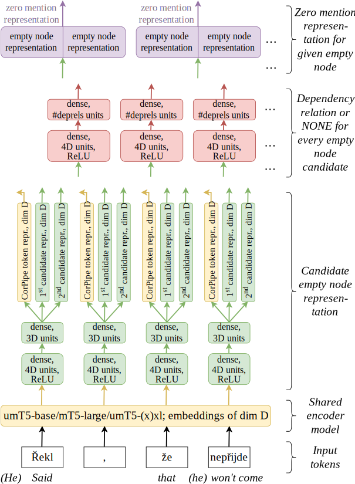
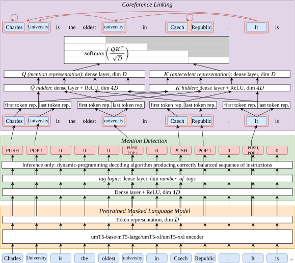
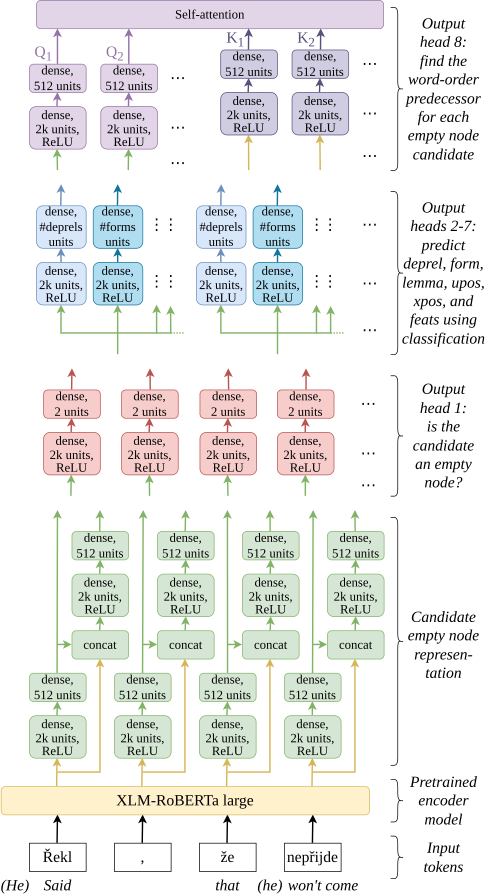

# CorPipe 26: CRAC 2026 Winning System for Multilingual Coreference Resolution

This repository contains the source code and the pre-trained models of CorPipe 26,
the CRAC 2026 winning system for multilingual coreference resolution, which
is described in the following paper:

---





<h3 align="center"><a href="https://aclanthology.org/2026.codi-1.27">CorPipe at CRAC 2026: Empty Nodes and Cross-Lingual Transfer in Multilingual Coreference Resolution</a></h3>

<p align="center">
  <b>Milan Straka</b><br>
  Charles University<br>
  Faculty of Mathematics and Physics<br>
  Institute of Formal and Applied Lingustics<br>
  Malostranské nám. 25, Prague, Czech Republic
</p> <br clear="both">

**Abstract:** We introduce CorPipe 26, our winning submission to the CRAC 2026
Shared Task on Multilingual Coreference Resolution. The fifth edition of this
shared task focuses mainly on the comparison of generative LLMs and specialized
systems; additionally, 5 more datasets and 2 new languages are introduced.
CorPipe 26 is an improved version of CorPipe 25, with a new variant predicting
empty nodes together with mentions and coreference links in a single model. Our
system outperforms all other submissions in the LLM track by 2.8 percent points
and all submissions in the unconstrained track by 9.5 percent points.
Furthermore, we perform a series of ablation experiments with different model
sizes, empty node prediction methods, and cross-lingual zero-shot evaluation.
The source code and the trained models are publicly available at
https://github.com/ufal/crac2026-corpipe.

---

## Content of this Repository

- The directories `data-onestage/` and `data-twostage/` are for the CRAC 2026 data,
  and the preprocessed and tokenized version needed for training.
  - The scripts `data-{one,two}stage/get.sh` download and extract the CRAC 2026 training and
    development data, plus the unannotated test data of the CRAC 2025 shared
    task, for the corresponding variant.

- The `corpipe26_onestage.py` and `corpipe26_twostage.py` are the complete source files
  of the CorPipe 26 one-stage and two-stage variants.

- The `corefud-score.sh` is an evaluation script used by CorPipe 26, which
  - performs evaluation (using the official evaluation script from the `corefud-scorer` submodule),
  - optionally (when `-v` is passed), it also:
    - runs validation (using the official UD validator from the `validator` submodule) on the output data,
    - performs evaluation with singletons,
    - performs evaluation with exact match.

- The `res.py` is our script for visualizing performance of running and finished
  experiments, and for comparing two experiments. It was developed for our needs
  and we provide it as-is without documentation.

# The Released Models

Three pretrained CorPipe 26 models have been released under the CC BY-NC-SA 4.0 license
on [LINDAT/CLARIAH-CZ](https://hdl.handle.net/11234/1-6205) and on HuggingFace:
- [corpipe26-onestage-corefud1.4-base-260702](https://huggingface.co/ufal/corpipe26-onestage-corefud1.4-base-260702)
- [corpipe26-onestage-corefud1.4-large-260702](https://huggingface.co/ufal/corpipe26-onestage-corefud1.4-large-260702)
- [corpipe26-onestage-corefud1.4-xl-260702](https://huggingface.co/ufal/corpipe26-onestage-corefud1.4-xl-260702)
- [corpipe26-twostage-corefud1.4-base-260702](https://huggingface.co/ufal/corpipe26-twostage-corefud1.4-base-260702)
- [corpipe26-twostage-corefud1.4-large-260702](https://huggingface.co/ufal/corpipe26-twostage-corefud1.4-large-260702)
- [corpipe26-twostage-corefud1.4-xl-260702](https://huggingface.co/ufal/corpipe26-twostage-corefud1.4-xl-260702)

See the respective model repositories for their performances and training
hyperparameters.

## Training a Multilingual `mT5-large`-based CorPipe 26 One-stage Model

To train a one-stage multilingual model on all the data using `mT5 large`, you should
1. run the `data-onestage/get.sh` script to download the CRAC 2026 data,
2. create a Python environments with the packages listed in `requirements.txt`,
3. train the model itself using the `corpipe26_onestage.py` script.

   For training a mT5-large variant with the default hyperparameters, use
   ```sh
   tbs="ca_ancora cs_pcedt cs_pdt cs_pdtsc cu_proiel de_potsdamcc en_fantasycoref en_gum en_litbank es_ancora fr_ancor fr_democrat fr_litbankfr grc_proiel hbo_ptnk hi_hdtb hu_korkor hu_szegedkoref ko_ecmt la_coreflat lt_lcc nl_openboek no_bokmaalnarc no_nynorsknarc pl_pcc ru_rucor tr_itcc"

   python3 corpipe26_onestage.py --train --dev --treebanks $(for c in $tbs; do echo data-onestage/$c/$c-corefud-train.conllu; done) --batch_size=8 --learning_rate=6e-4 --learning_rate_decay --adafactor --encoder=google/mt5-large --exp=corpipe26-onestage-corefud1.4-large --compile
   ```

## Predicting with a CorPipe 26 Model

To predict with a trained model, use the following arguments:
```sh
corpipe26_onestage.py --load ufal/corpipe26-onestage-corefud1.4-large-260702 --exp target_directory --epoch 0 --test input1.conllu input2.conllu
```
- instead of a HuggingFace identifier, you can use directory name – if the given path name exists,
  the model is loaded from it;
- the outputs are generated in the target directory, with `.00.conllu` suffix;
- if you want to also evaluate the predicted files, you can use `--dev` option instead of `--test`;
- optionally, you can pass `--segment 2560` to specify longer context size, which very likely produces
  better results, but needs more GPU memory.

## Running the Model on Plain Text

To run the model on plain text, first the plain text needs to be tokenized and
converted to CoNLL-U (and optionally parsed if you also want mention heads),
by using for example UDPipe 2:

```sh
curl -F data="Susan came home and Martin greeted her there. Then Martin and Paul left for a trip and Susan waved them off." \
  -F model=english -F tokenizer= -F tagger= -F parser=  https://lindat.mff.cuni.cz/services/udpipe/api/process \
  | python -X utf8 -c "import sys,json; sys.stdout.write(json.load(sys.stdin)['result'])" >input.conllu
```

Then the CoNLL-U file can be processed by CorPipe 26, by using for example
```sh
python3 corpipe26_onestage.py --load ufal/corpipe26-onestage-corefud1.4-large-260702 --exp . --epoch 0 --test input.conllu
```
which would generate the following predictions in `input.00.conllu`:
```
# generator = UDPipe 2, https://lindat.mff.cuni.cz/services/udpipe
# udpipe_model = english-ewt-ud-2.17-251125
# udpipe_model_licence = CC BY-NC-SA
# newdoc
# global.Entity = eid-etype-head-other
# newpar
# sent_id = 1
# text = Susan came home and Martin greeted her there.
1	Susan	Susan	PROPN	NNP	Number=Sing	2	nsubj	_	Entity=(c1--1)
2	came	come	VERB	VBD	Mood=Ind|Number=Sing|Person=3|Tense=Past|VerbForm=Fin	0	root	_	_
3	home	home	ADV	RB	_	2	advmod	_	Entity=(c2--1)
4	and	and	CCONJ	CC	_	6	cc	_	_
5	Martin	Martin	PROPN	NNP	Number=Sing	6	nsubj	_	Entity=(c3--1)
6	greeted	greet	VERB	VBD	Mood=Ind|Number=Sing|Person=3|Tense=Past|VerbForm=Fin	2	conj	_	_
7	her	she	PRON	PRP	Case=Acc|Gender=Fem|Number=Sing|Person=3|PronType=Prs	6	obj	_	Entity=(c1--1)
8	there	there	ADV	RB	PronType=Dem	6	advmod	_	Entity=(c2--1)|SpaceAfter=No
9	.	.	PUNCT	.	_	2	punct	_	_

# sent_id = 2
# text = Then Martin and Paul left for a trip and Susan waved them off.
1	Then	then	ADV	RB	PronType=Dem	5	advmod	_	_
2	Martin	Martin	PROPN	NNP	Number=Sing	5	nsubj	_	Entity=(c4--1(c3--1)
3	and	and	CCONJ	CC	_	4	cc	_	_
4	Paul	Paul	PROPN	NNP	Number=Sing	2	conj	_	Entity=(c5--1)c4)
5	left	leave	VERB	VBD	Mood=Ind|Number=Sing|Person=3|Tense=Past|VerbForm=Fin	0	root	_	_
6	for	for	ADP	IN	_	8	case	_	_
7	a	a	DET	DT	Definite=Ind|PronType=Art	8	det	_	_
8	trip	trip	NOUN	NN	Number=Sing	5	obl	_	_
9	and	and	CCONJ	CC	_	11	cc	_	_
10	Susan	Susan	PROPN	NNP	Number=Sing	11	nsubj	_	Entity=(c1--1)
11	waved	wave	VERB	VBD	Mood=Ind|Number=Sing|Person=3|Tense=Past|VerbForm=Fin	5	conj	_	_
12	them	they	PRON	PRP	Case=Acc|Number=Plur|Person=3|PronType=Prs	11	obj	_	Entity=(c4--1)
13	off	off	ADP	RP	_	11	compound:prt	_	SpaceAfter=No
14	.	.	PUNCT	.	_	5	punct	_	SpaceAfter=No

```

## How to Cite

```
@inproceedings{straka-2026-corpipe,
  title = "{C}or{P}ipe at {CRAC} 2026: Empty Nodes and Cross-Lingual Transfer in Multilingual Coreference Resolution",
  author = "Straka, Milan",
  editor = "Braud, Chlo{\'e}  and Hardmeier, Christian  and Ogrodniczuk, Maciej  and Loaiciga, Sharid  and
    Zeldes, Amir  and Nov{\'a}k, Michal  and Li, Chuyuan  and Strube, Michael  and Li, Junyi Jessy",
  booktitle = "Proceedings of the 2nd Joint Workshop on Computational Approaches to Discourse, Context and
    Document-Level Inferences and Computational Models of Reference, Anaphora and Coreference ({CODI}-{CRAC} 2026)",
  month = jul,
  year = "2026",
  address = "San Diego, California, USA",
  publisher = "Association for Computational Linguistics",
  url = "https://aclanthology.org/2026.codi-1.27/",
  doi = "10.18653/v1/2026.codi-1.27",
  pages = "205--216",
  ISBN = "979-8-89176-400-2"
}
```
